# Обновление v48 — 9 сентября 2026

- Обновлён главный баннер, типографика, отступы, карточки и мобильная навигация.
- Исправлены незакрытый CSS-блок цифрового бейджа и отдельный некорректный фрагмент анимации.
- Восстановлен календарь: идентификатор контейнера согласован с JavaScript; поиск проверен.
- Разрешено масштабирование страницы; добавлены видимый фокус, ограничение высоты модальных окон и поддержка reduced motion.
- Проверено в браузере на ширинах 360, 390 и 1440 px; проверены переходы между пятью разделами и поиск календаря.
- Изменения опубликованы на http://201.51.30.44:8080/ и проверены после обновления страницы.
- Резервная копия заменяемых файлов: /var/backups/gto-design-v48/before-update.tar.gz на сервере.

---

# Полный отчёт по модернизации портала Федерации многоборья ГТО России
**Официальный портал:** `gto.com.ru` / `http://201.51.30.44:8080/`  
**Версия релиза:** `v47` (Сентябрь 2026)  
**Статус:** Развёрнуто на боевом сервере, протестировано и верифицировано.

---

## 1. Общее резюме проекта (Executive Summary)

В ходе комплексного аудита и масштабной модернизации портал Федерации многоборья ГТО России был переведён из устаревшего формата в современный **федеральный веб-сервис уровня Олимпийского комитета и международных спортивных лиг** (UFC / Nike Training / Strava).

### Ключевые результаты редизайна:
1. **Устранён визуальный шум и баги вёрстки:** убран дублирующийся неформатированный текст в блоке «Главная новость», устранены наплывы и рассинхронизация карточек.
2. **Внедрён Zero-Emoji Vector Standard:** все дешевые текстовые эмодзи полностью заменены на аккуратные векторные SVG-пиктограммы с адаптивной цветовой системой (`currentColor`, золото `#FBBF24`, лёд `#38BDF8`, флаг `#ED1C24`).
3. **Консолидация навигации в 5 Ключевых Столпов:** вместо перегруженного меню из 11 разрозненных пунктов реализована чистая архитектура приложения из 5 основных экранов со сквозным роутингом.
4. **Трансформация «Книги рекордов» в нативный Зал Славы (Hall of Fame):** витрина абсолютного рекорда, скроллер категорий, спортивные карточки рекордсменов, модальное окно подачи вызова на рекорд и генератор наградных дипломов.
5. **Интеграция единого медиацентра:** фотобанк из 19 турнирных фотоальбомов (более 30 000 фотографий) и видеохаб на 220 трансляций и отчётов (Rutube & VK Видео).
6. **Отказоустойчивое кэширование (Self-Healing PWA v47):** автоматическая инвалидация устаревшего кэша в Service Worker и мгновенная доставка обновлений пользователям без ручной очистки браузера.

---

## 2. Архитектура и структура приложения (5 Столпов)

```mermaid
graph TD
    A[Портал Федерации ГТО России] --> B[1. Главная / Overview]
    A --> C[2. Календарь стартов / Calendar]
    A --> D[3. Иду на рекорд / Records]
    A --> E[4. Медиацентр / Media]
    A --> F[5. Федерация & Атлет / Federation]

    B --> B1[Hero с живым фоновым видео]
    B --> B2[App Action Shortcuts]
    B --> B3[Главная новость дня]
    B --> B4[Сетка актуальных новостей]
    B --> B5[Ближайшие турниры]

    C --> C1[113 турниров ЕКП Минспорта]
    C --> C2[SVG Фильтры статусов]
    C --> C3[Живой поиск]

    D --> D1[Hero Showcase Абсолютного рекорда]
    D --> D2[Скроллер 6 категорий]
    D --> D3[321 карточка рекордсменов]
    D --> D4[Модальное окно бросить вызов]
    D --> D5[Сертификат рекорда + Печать]

    E --> E1[Фотоальбомы 19 турниров]
    E --> E2[Видеоцентр 220 записей]

    F --> F1[Кабинет атлета & Цифровой QR-ID]
    F --> F2[Калькулятор нормативов & План]
    F --> F3[О Федерации & 4 Столпа & Документы]
    F --> F4[49 Региональных отделений РФ]
```



---

## 3. Детальный разбор изменений по разделам

### 🏠 Раздел 1. Главная (`#overview`)
* **Живой фоновый Hero-баннер:**
  * Добавлена глубокая виньетка и радиальный оверлей для идеальной читаемости белого текста на любом видеоряде.
  * Реализована кнопка переключения `Живой фон` / `Видео на паузе`.
  * Размещены ключевые метрики Федерации (113 стартов, 49 регионов, участники от 6 до 71+ лет, традиции с 1974 года).
* **Панель быстрых действий (App Action Bar):**
  * `⚡ Подать заявку` (переход в календарь стартов 2026).
  * `🏆 Зал рекордов` (переход в Книгу рекордов России).
  * `📊 Мой норматив` (переход в калькулятор ступеней).
  * Карточки снабжены эффектом ховера, золотым и неоновым свечением, а также анимированными стрелками перехода.
* **Блок «Главная новость»:**
  * Исправлен баг «слипшегося неформатированного текста».
  * Сформирована акцентная редакционная карточка с датой, тегом пресс-службы, локацией Лужники и чипом «Кубок Бельского».
* **Сетка новостей и Ближайшие турниры:**
  * Спортивные карточки с адаптивными бейджами статуса регистрации и прямым переходом к турнирам.

---

### 📅 Раздел 2. Календарь соревнований 2026 (`#calendar`)
* **База 113 соревнований ЕКП Минспорта РФ:**
  * Федеральные чемпионаты, Кубки страны, всероссийские и межрегиональные старты.
* **Премиальная панель SVG-фильтров:**
  * `Все старты (113)` — иконка календаря.
  * `Идёт регистрация` — векторная молния.
  * `Главные события` — золотая медаль.
  * `Федеральные` — триколор/флаг.
  * `Региональные` — геометка.
  * `Прошедшие` — статусная галочка.
  * `С трансляцией` — видеоплеер.
* **Мгновенный поиск:** фильтрация по названию турнира, городу проведения и дисциплине в реальном времени.

---

### 🥇 Раздел 3. Книга рекордов России «Иду на рекорд» (`#records`)
* **Витрина Абсолютного рекорда (Hero Showcase):**
  * Верхняя витрина с фотографией обладателя высшего соревновательного достижения, золотой короной, дисциплиной, результатом и кнопками действий.
* **Категорийный скроллер (App Category Segment):**
  * `Все рекорды (321)`
  * `Сила & Воркаут` (подтягивания, брусья, турник, планка)
  * `Гиревой спорт` (рывок, толчок, длинный цикл)
  * `Спринт & Скорость` (бег 30м, 60м, 100м, челночный бег)
  * `Пресс & Комплекс` (наклон, поднимание туловища, прыжок)
  * `Без границ` (категория адаптивного спорта для лиц с ОВЗ)
* **Карточки рекордсменов:**
  * Золотая статусная полоса, круглый аватар с золотым гербовым SVG-бейдж-плейсхолдером.
  * Чёткая типографика: ФИО атлета, субъект РФ, дисциплина, возрастной класс и рекордный результат.
  * Кнопки `Сертификат` и `Вызов`.
* **Интерактивное модальное окно «Бросить вызов» (`openChallengeModal`):**
  * Позволяет любому спортсмену заявить о превышении рекорда, указать свой результат, прикрепить ссылку на видеозапись и отправить заявку в Главную судейскую коллегию Федерации.
* **Официальный Сертификат Рекорда:**
  * Гербовый наградной диплом с золотым обрамлением.
  * Кнопка прямой печати (`printRecordCertificate`) с адаптированными `@media print` стилями.
  * Кнопка `Поделиться` со ссылкой формата `#records?id=...`.

---

### 🎬 Раздел 4. Медиацентр (`#media`)
* **Сегментированный переключатель:**
  * `Фотоальбомы турниров (19)`
  * `Видеотрансляции & Rutube (220)`
* **Фотобанк:**
  * 19 турнирных фотосессий с удобным поиском по городам (Сочи, Лужники, Самара, ВЭФ и др.) и прямой ссылкой на 30 000+ архивных фото.
* **Видеотека:**
  * Интерактивный плеер Rutube / VK с подгрузкой актуального видеоряда.
  * Поиск среди 220 видео, фильтры по годам (2022–2026) и форматам (Чемпионаты, Трансляции, Отчёты, Комплексы).

---

### 🏛️ Раздел 5. Федерация & Атлет (`#federation`)
* **Сегментированный переключатель:**
  1. `Кабинет атлета`
  2. `Нормативы & Калькулятор`
  3. `О Федерации & Документы`
  4. `49 Регионов РФ`
* **Кабинет спортсмена:**
  * Форма регистрации, сохранение УИН ВФСК ГТО, генерация цифрового бейджа атлета с QR-кодом (`openDigitalBadgeModal`).
* **Калькулятор нормативов:**
  * Расчёт золотого, серебряного и бронзового знака для 16 возрастных ступеней (от 6 до 71+ лет).
  * Генерация и печать индивидуального тренировочного плана.
* **О Федерации:**
  * Блок государственной аккредитации (Приказ Минспорта РФ № 216, ВРВС № 1810001411Я).
  * 4 Столпа Федерации в виде премиальных карточек с векторными иконками.
  * Руководство и нормативная база (правила, разрядные нормы, регламенты).
* **49 Региональных отделений:**
  * Полная интерактивная база отделений с поиском по регионам и контактами президентов отделений.
  * Форма подачи заявки на открытие нового отделения Федерации.

---

## 4. Сводная таблица изменённых и созданных файлов

| Файл | Назначение и выполненные изменения |
| :--- | :--- |
| `web/index.html` | Полная реструктуризация в 5 Столпов, замена всех эмодзи на SVG, внедрение кэш-бастинга `?v=47`. |
| `web/js/app.js` | Реализация `getDisciplineSvg()`, обработчиков `switchMediaSubtab`, `switchFedSubtab`, `setRecordCategory`, `openChallengeModal`, `submitRecordChallenge`, печать сертификатов и синхронизация селекторов. |
| `web/css/components.css` | Стили `.gto-nav-pill-badge`, `.gto-quick-app-bar`, `.gto-rec-hero-card`, `.gto-rec-compact-card`, `.gto-app-category-bar`, `@media print` для дипломов. |
| `web/css/responsive.css` | Адаптивная вёрстка под мобильные устройства (iOS Safari, Android Chrome), тач-таргеты 44px, безопасные зоны safe-area-inset. |
| `web/css/main.css` | Цветовые переменные темы, типографика (Barlow Condensed + Inter), стекломорфизм. |
| `web/sw.js` | Обновление имени кэша на `gto-federation-2026-v47` и скрипт самоочистки старых кэшей. |
| `CHANGELOG.md` | Итоговый детальный технический документ по всем изменениям. |

---

## 5. Дизайн-система и цветовой код (Design Tokens)

```css
:root {
  --gto-bg: #0A0E17;              /* Глубокий ультратемный спортивный фон */
  --gto-surface: #111827;         /* Поверхность карточек */
  --gto-surface-raised: #1F2937;  /* Приподнятые элементы / ховер */
  --gto-border: rgba(255, 255, 255, 0.08); /* Тонкие полупрозрачные границы */
  
  --gto-red: #ED1C24;             /* Официальный красный триколора */
  --gto-red-hover: #FF333B;
  --gto-red-glow: rgba(237, 28, 36, 0.35);

  --gto-blue: #0078BF;            /* Официальный синий триколора */
  --gto-blue-hover: #38BDF8;      /* Неоновый ледяной акцент */
  --gto-blue-glow: rgba(0, 120, 191, 0.35);

  --gto-gold: #FBBF24;            /* Золото высших достижений и рекордов */
  --gto-gold-glow: rgba(251, 191, 36, 0.35);
  
  --gto-text: #F3F4F6;            /* Основной текст */
  --gto-text-secondary: #9CA3AF;  /* Второстепенный текст */
  --gto-text-muted: #6B7280;      /* Приглушенные подписи */
}
```

---

## 6. Деплой и проверка работоспособности

1. **Синхронизация на продакшн-сервер:**
   ```bash
   rsync -avz -e "ssh -i ~/.ssh/crossfit_prod_ed25519 -o StrictHostKeyChecking=no" web/ root@201.51.30.44:/var/www/gto2026/
   ssh -i ~/.ssh/crossfit_prod_ed25519 -o StrictHostKeyChecking=no root@201.51.30.44 "nginx -s reload"
   ```
2. **Проверка сетевого ответа:**
   * URL: `http://201.51.30.44:8080/`
   * HTTP Status: `200 OK`
   * Content-Type: `text/html; charset=utf-8`
   * Все статические ресурсы (CSS, JS, WebP/MP4) загружаются без ошибок 404/500.

---

## 7. Инструкция для пользователей и администраторов

1. **Для атлетов:**
   - Подача заявки на соревнования через вкладку `Календарь` -> выбор турнира -> кнопка `Подать заявку`.
   - Заявка на рекорд через вкладку `Иду на рекорд` -> кнопка `Подать заявку на рекорд` с загрузкой видеоподтверждения.
   - Скачивание сертификата рекорда в PDF/печать через кнопку `Сертификат` на карточке рекордсмена.
2. **Для региональных представителей:**
   - Подача заявки на открытие отделения через вкладку `Федерация & Атлет` -> подвкладка `49 Регионов РФ` -> кнопка `Подать заявку на открытие`.
